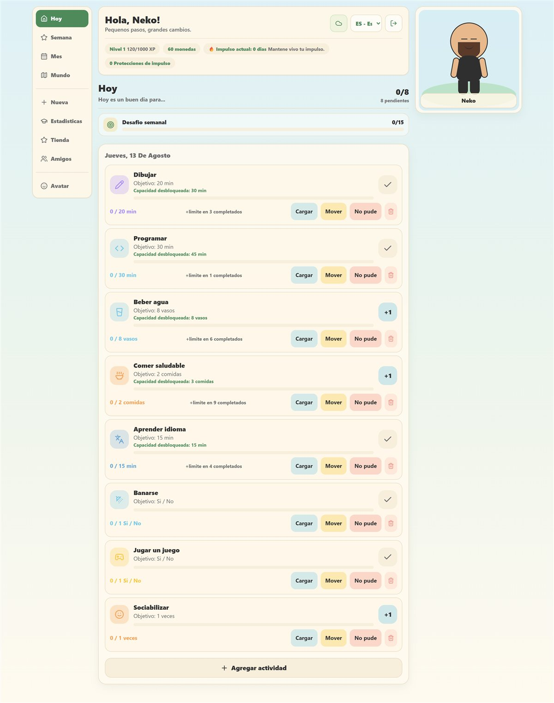
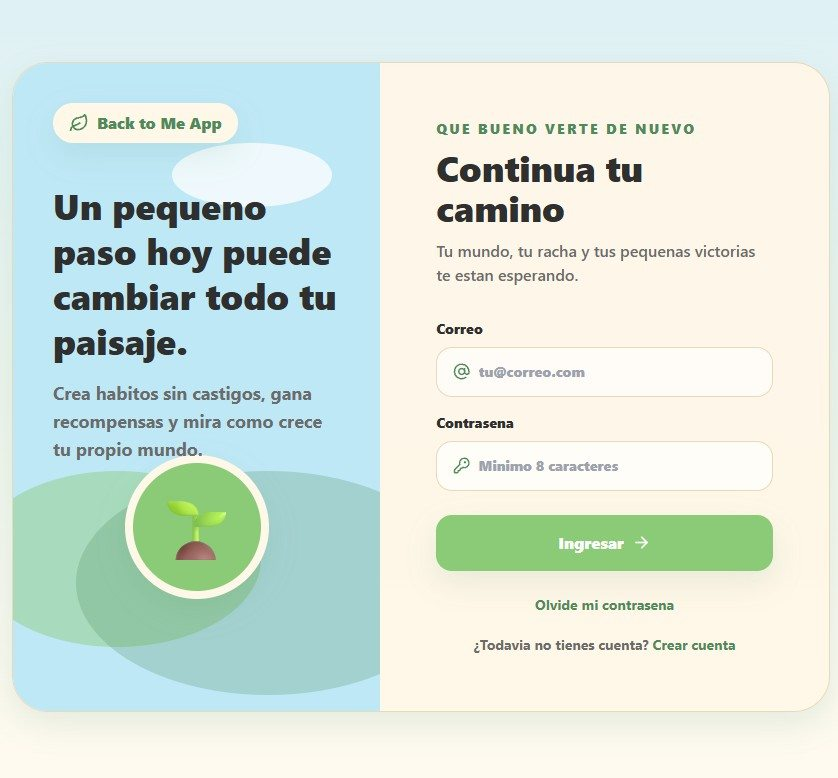

# 🎯 Back to Me

> App gamificada de seguimiento de hábitos y bienestar: registrá pequeñas acciones cada día, ganá XP y monedas, hacé crecer tu avatar y tu mundo, y sostené tu racha ("impulso") sin castigos.


### 🌐 [Ver demo en vivo →](https://back-to-me-game.vercel.app)

## 📸 Vista previa



<p align="center">
  
</p>

## ✨ Qué hace

- **Hábitos sin castigos:** cada día proponés pequeñas acciones (dibujar, programar, beber agua, comer saludable, aprender un idioma…) con objetivos propios.
- **Progreso por día / semana / mes:** seguí tu evolución en el tiempo y un **desafío semanal**.
- **Gamificación:** ganás **XP y niveles**, **monedas**, y una **racha ("impulso")** con protecciones para no perderla.
- **Avatar y mundo:** personalizás tu avatar en la **tienda** y hacés crecer tu propio mundo a medida que avanzás.
- **Social:** sumás **amigos** para acompañar el proceso.
- **Estadísticas:** panel con tu actividad y capacidades desbloqueadas.

## 🛠️ Stack

- **Next.js** (App Router) + **React** + **TypeScript**
- **Tailwind CSS**
- **Supabase** (PostgreSQL + Auth)
- **Vercel** (deploy)

## 🚀 Cómo correrlo local

**Requisitos:** Node.js 20+.

```bash
npm install
cp .env.example .env.local   # completá tus variables de Supabase
npm run dev
```

Variables necesarias (ver [`.env.example`](.env.example)):

```text
NEXT_PUBLIC_SUPABASE_URL=
NEXT_PUBLIC_SUPABASE_PUBLISHABLE_KEY=
```

Otros comandos:

```bash
npm run check   # verificaciones
npm test        # tests
npm run build   # build de producción
```

## 📌 Estado

Proyecto **en desarrollo activo**. Ya funciona el registro de actividades, el progreso por día/semana/mes, la gamificación (XP, niveles, monedas, racha), el avatar y la autenticación con Supabase.

---

<sub>Desarrollado por <b>Marcos Javier Martínez</b> · <a href="https://www.linkedin.com/in/marcos-martinez-83a033215/">LinkedIn</a></sub>
